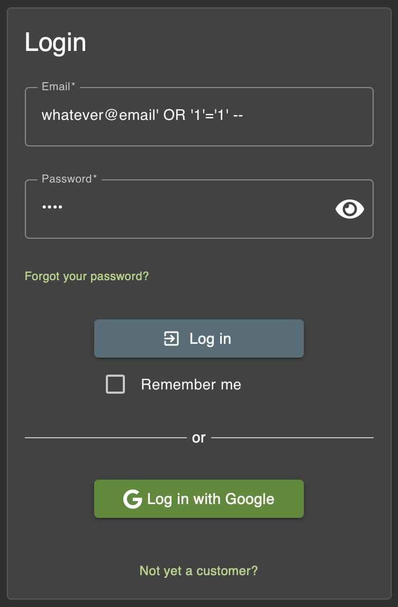
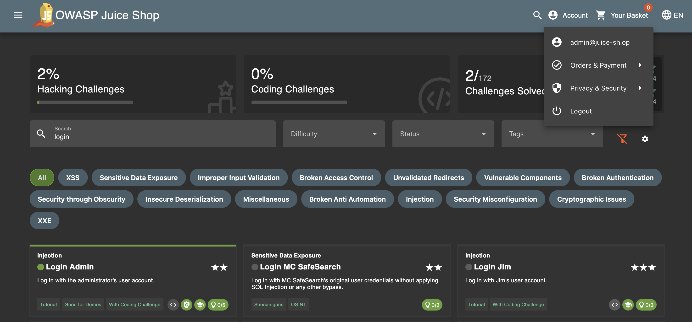
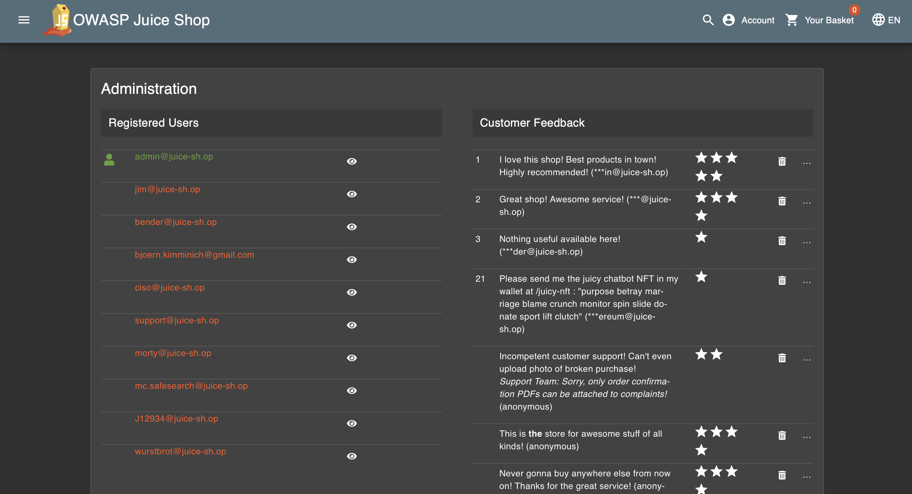
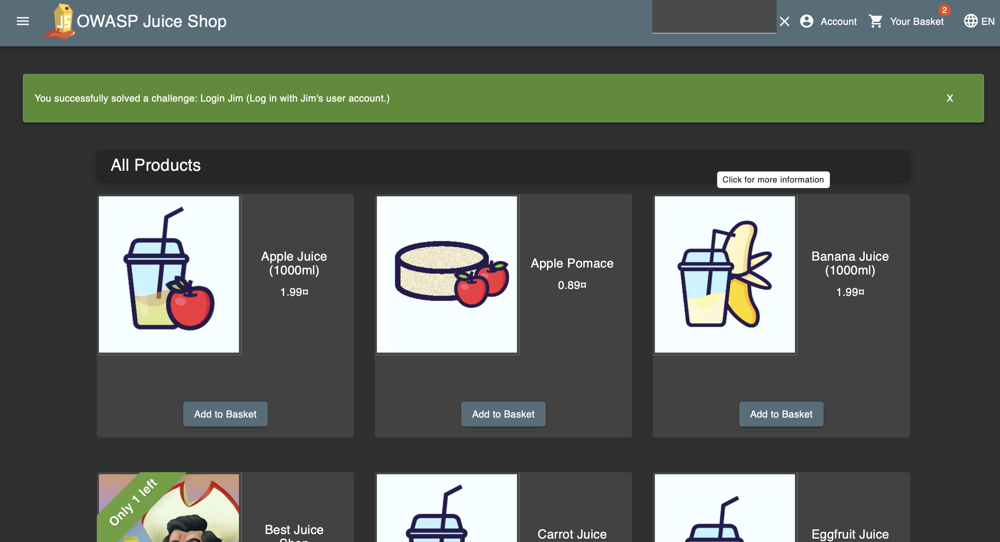

# Juice-Shop Solutions

Some notes on the manual exploration of unsafe input fields in the application. This exploration might help us discover how a GUI fuzzer could find bugs for us.

## Focus area 1: Login Admin

> Disclaimer: The solution was provided from this [Github Repo](https://github.com/Whyiest/Juice-Shop-Write-up/blob/main/2-stars/login_admin.md). Inspecting this solution, I could follow the same principles manually.

### Challenge Overview

**Title:** Login Admin\
**Category:** SQL Injection\
**Difficulty:** ⭐⭐ (2/6)

This challenge, titled "Login Admin," requires exploiting an SQL Injection vulnerability within the authentication process of a web application to gain unauthorized access to the administrator's account.

### Methodology and Solution

#### Identifying the Vulnerability

Upon analyzing the login mechanism, it was noted that inserting special characters such as quotes (`'`) into the input fields caused SQL errors to be displayed, indicating the potential for an SQL Injection attack.

#### Steps Taken to Solve the Challenge

- Injecting the following SQL command into the email input-field will always evaluate to true:
- `whatever@email' OR '1'='1' --`
- This will break the query and we will login the first account of the table, which is the administrator 
- 
- This will send a request to the server, allowing unauthorized access to the administrator's account. This successfully solves the task to login the account.
- 

## Focus area 2: Login as Jim

Before proceeding with the next focus area, we had to figure out what Jim's email was. This was discovered by locating the Administration page.

### Locating the Administration page

Similar to the solution to the scoreboard page, the administration page can be located by navigating to this URL, while being logged in as an admin account (which we learned how to do in the solution above).

    http://localhost:3000/#/administration

This successfully redirects us to the administration page, from where we can inspect all the accounts on the service.



We will now try to login Jim's account using fuzzing. But first a manual fuzzer.

## Impersonating Jim's account

> Disclaimer: solution found on [medium.com](https://medium.com/@aayushdharwal73/owasp-juice-shop-injection-challenges-a7808b648395)

Similar to the query we exectued before, we will execute the following query in the e-mail field

    jim@juice-sh.op' -- 

This successfully logs us into Jim's account, because the trailing single quote (`'`) closes the string literal that the application opened around the email value. The `--` begins a single-line comment, so the database will ignore everything after it on that line (in many SQL dialects).

Combined, these two actions let us terminate the email literal and then comment out the rest of the WHERE clause (typically the password check), so the query may authenticate without needing the correct password.

The SQL query that is executed is therefore something like the following:

```SQL
SELECT * FROM accounts
WHERE email = 'jim@juice-sh.op' -- ' AND password = '';
--                            ^ close quote and start comment
-- Everything after -- is treated as a comment and ignored by the DB.
```

This is why we get logged in as Jim.



## Fuzzing

The pattern seems to be that for any account in the db, the following query in the email will comment out the rest of the query, leading to unintended behaviour. Maybe we could use this in our fuzzing?

```
' -- 
```


